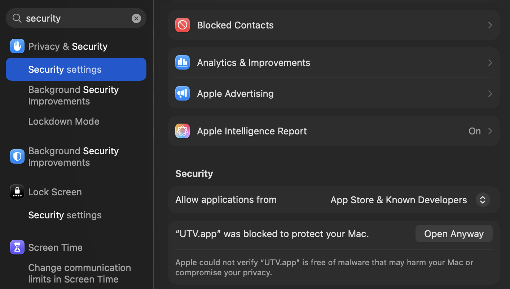

# UTV

---

<p align="center">
  
</p>

<p align="center">
  <a href="https://github.com/OpenUTV/utv/releases"></a>
  <a href="https://github.com/OpenUTV/utv/actions/workflows/build-and-release.yml"></a>
  
  <a href="https://github.com/OpenUTV/utv/stargazers"></a>
</p>

---

## A Player for the Masses

UTV is a highly performant, lightweight, and modern image and sequence viewer.

Originally forked from visual effects industry software [OpenRV](https://github.com/AcademySoftwareFoundation/OpenRV), UTV is designed to be a **distributable framecycler that anyone can install and run instantly**. We have stripped away massive legacy build times and enterprise reference platform constraints to build a streamlined, cutting-edge tool for artists, editors, supervisors, and studios alike.

### Why OpenUTV?

- **Fast Build Times**: A clean build from scratch on an M4 MacBook Air takes just **4:30 minutes**; cached incremental rebuilds take under **50 seconds** (compared to hours for legacy enterprise VFX builds).
- **Lightweight & Redistributable**: We prioritize a zero-config, portable distribution with an intelligent native trampoline launcher that guides missing dependencies instead of crashing.
- **Always-Current Dependencies**: All libraries (OpenEXR, OpenColorIO, OpenTimelineIO, Qt, FFmpeg, Imath, LibRaw, Boost, etc.) track the **latest published releases** from their respective upstream authors. You get modern features, performance boosts, and critical security patches immediately—without waiting for multi-year enterprise reference platform cycles.
- **Community-Driven Velocity**: OpenUTV is built for and by the creative community. We prioritize rapid review and merging of community pull requests, shipping updates with agility and momentum.

---

## Standing on the Shoulders of Giants

We want to express our sincere gratitude and deepest respect to the **[OpenRV](https://github.com/AcademySoftwareFoundation/OpenRV)** team, **Autodesk**, and the **Academy Software Foundation (ASWF)**.

The original RV engine is a triumph of engineering that has powered feature film and episodic visual effects for decades. We have the utmost respect for the OpenRV maintainers and the complex backwards-compatibility constraints under which enterprise pipelines operate.

OpenUTV is committed to being an active, positive part of the open-source visual effects ecosystem. We will continue to incorporate upstream fixes that OpenRV develops, and we actively hope the OpenRV project and the broader ASWF community benefit from our commits, performance improvements, and platform modernizations in return.

---

## Key Features & Capabilities

- **Modern 10-Bit Color Pipeline**: Native 10-bit Metal presentation on macOS (Extended Dynamic Range / EDR) and 10-bit Vulkan presentation on Linux & Windows, plus an integrated 10-bit diagnostic test pattern suite.
- **Hardware-Accelerated Video**: Native Apple Silicon VideoToolbox hardware decoding enabled by default for silky-smooth high-bitrate 4K/8K playback.
- **Native Apple ProRes RAW**: Out-of-the-box 16-bit half-float ProRes RAW decoding via AVFoundation and FFmpeg.
- **Multi-Page PDF Document Viewing**: Review storyboards, scripts, lookbooks, and contact sheets natively alongside video and sequence assets, complete with automatic margin auto-cropping.
- **Professional Video I/O**: Dynamic runtime support for NDI 6, Blackmagic Design DeckLink, and AJA Video Systems without licensing lock-in or bloated SDK dependencies.
- **Comprehensive Format Support**: OpenEXR (multi-part & deep), DPX, Cineon, TIFF, PNG, JPEG, JPEG 2000 (HTJ2K), WebP, Targa, RAW camera files (CR2, NEF, ARW), and modern video containers.

---

## Installation

### macOS (Homebrew Cask — Recommended)

Install the pre-compiled native macOS (Apple Silicon) binary directly from our custom Homebrew tap:

```bash
brew tap OpenUTV/utv https://github.com/OpenUTV/utv
brew install --cask utv
```

This automatically installs `UTV.app` along with all required multimedia dependencies (`ffmpeg-full`, `qt`, `opencolorio`, `openimageio`, `openexr`, etc.).

### macOS (Standalone ZIP Release)

You can also download the standalone `UTV-<version>-macOS-arm64.zip` directly from our **[Releases](https://github.com/OpenUTV/utv/releases)** page:

1. Unzip `UTV.app` and drag it to `/Applications`.
2. Launch `UTV.app`. Because OpenUTV is currently ad-hoc signed, macOS Gatekeeper may present a dialog stating that the app cannot be opened.
3. Open **System Settings** -> **Privacy & Security**, scroll down to the **Security** section, and click **Open Anyway** next to the prompt stating *"UTV.app" was blocked to protect your Mac*.

<p align="center">
  
</p>

4. Alternatively, you can clear the quarantine attribute via Terminal:

```bash
xattr -cr /Applications/UTV.app
```

5. When UTV launches, its built-in **Dependency Assistant** will verify your installed Homebrew libraries and offer to install any missing ones with a single click.

*(Native installers for Linux (`.deb`/`.rpm`) and Windows (`.msi`/`.exe`) are actively in progress!)*

---

## Building from Source

If you want to build UTV from source or contribute to the project, the process is straightforward:

### 1. Install Dependencies (macOS)

```bash
brew install ninja readline sqlite3 xz zlib tcl-tk@8 python-tk autoconf automake libtool python@3.14 yasm clang-format black meson nasm pkg-config glew ccache qt ffmpeg-full openexr imath opencolorio libraw libtiff libpng boost openimageio openjpeg webp yaml-cpp spdlog icu4c openjph jpeg-turbo
```

### 2. Build the Application

```bash
git clone --recursive https://github.com/OpenUTV/utv.git
cd utv
./build.sh --release --clean
```

The compiled binary bundle will be placed in `_build/stage/app/UTV.app`.

---

## Professional Video I/O

UTV dynamically supports professional video output using NDI, Blackmagic Design, and AJA Video Systems. Because we use dynamic runtime loading, UTV is completely unburdened by proprietary SDK restrictions.

If you have the appropriate drivers and runtimes installed on your machine, UTV will automatically detect them and enable the output features:

- **NDI**: Download and install the NDI Runtime from [https://ndi.video/tools/](https://ndi.video/tools/) (or the NDI SDK [macOS](https://downloads.ndi.tv/SDK/NDI_SDK_Mac/Install_NDI_SDK_v6_Apple.pkg), [Linux](https://downloads.ndi.tv/SDK/NDI_SDK_Linux/Install_NDI_SDK_v6_Linux.tar.gz), [Windows](https://downloads.ndi.tv/SDK/NDI_SDK/NDI%206%20SDK.exe)).
- **Blackmagic Design**: Download the "Desktop Video" driver from the [Blackmagic Design Support Center](https://www.blackmagicdesign.com/support/family/capture-and-playback).
- **AJA Video Systems**: Download the "Desktop Software" driver from the [AJA Support Center](https://www.aja.com/support).

---

## FFmpeg & Codec Architecture

UTV dynamically links to **FFmpeg** at runtime to provide broad playback support across professional multimedia formats without licensing or redistribution restrictions. Because UTV resolves FFmpeg dynamically, updating or replacing your local FFmpeg installation directly enables hardware encoding/decoding and extended codec support without recompiling UTV:

- **macOS**: UTV leverages Homebrew's `ffmpeg-full` formula, automatically installed when using `brew install --cask utv`. This provides extensive codec support (H.264, H.265/HEVC, VP9, AV1, ProRes, DNxHD, etc.) without requiring custom compilation. In addition, Apple Silicon Macs benefit from native **VideoToolbox** hardware decoding and native **AVFoundation ProRes RAW** decoding out of the box.
- **Windows**: The default distribution discovers FFmpeg DLLs via your system `PATH` or directly alongside `UTV.exe`.

### Fully Loaded FFmpeg on Windows (Hardware Acceleration & Custom Codecs)

For Windows environments requiring full hardware acceleration (NVIDIA NVDEC/NVENC, Intel QSV, AMD AMF) and non-free codecs (such as FDK-AAC, x264, x265, and DeckLink I/O), you can supply a fully loaded FFmpeg build using either approach below:

#### Option A: Pre-Built Shared Build

1. Download a pre-compiled **shared** release (e.g., `ffmpeg-release-full-shared.7z` from [Gyan.dev](https://www.gyan.dev/ffmpeg/builds/) or [BtbN/FFmpeg-Builds](https://github.com/BtbN/FFmpeg-Builds/releases)).
2. Extract the archive and copy the `.dll` files from the `bin/` directory directly into the folder where `UTV.exe` is installed (or add the `bin/` directory to your system `PATH`).

#### Option B: Compile via vcpkg

If you have Visual Studio Build Tools and [vcpkg](https://github.com/microsoft/vcpkg) installed, you can compile a full-featured shared build with custom hardware modules:

```powershell
vcpkg install ffmpeg[nvcodec,qsv,amf,decklink,fdk-aac,x264,x265]:x64-windows
```

Once complete, copy the `.dll` files from `vcpkg/packages/ffmpeg_x64-windows/bin` directly into your UTV installation directory.

---

## Support OpenUTV

OpenUTV is completely free and open-source. If you use UTV in your studio pipeline or freelance workflows and want to support its ongoing development, you can help fund the project!

- **[Donate via Stripe](https://donate.stripe.com/eVqbJ29K73to7446oNdAk00)** (Credit Card/Apple Pay)

**Crypto Donations:**

| Bitcoin (BTC) | Ethereum (ETH) | Solana (SOL) |
| :---: | :---: | :---: |
|  |  |  |

*(Full addresses below for copy/pasting)*

- **BTC:** `bc1qwpd4nmz409xx3x5n9z76avnv7rqucu8w53aejy`
- **ETH:** `0xB9Ab3823a967804EdE427541F36E785912b67f98`
- **SOL:** `9EdidyxKi9rwx35yvi5FVr7bDkFMPUUKMhFCdp4ASNG7`

---

## Contributing & Governance

We welcome community contributions! Please read our [CONTRIBUTING.md](.github/CONTRIBUTING.md) and [GOVERNANCE.md](docs/GOVERNANCE.md) to get started.

## Star History

[](https://star-history.com/#OpenUTV/utv&Date)

---

## About Third-Party Licenses

See [THIRD-PARTY.md](docs/THIRD-PARTY.md) for license information about portions of UTV that have been imported from other projects.
