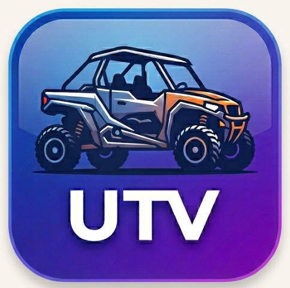

# UTV

---

<p align="center">
  
</p>

<p align="center">
  <a href="https://github.com/OpenUTV/utv/releases"></a>
  <a href="https://github.com/OpenUTV/utv/actions/workflows/build-and-release-macos.yml"></a>
  
  <a href="https://github.com/OpenUTV/utv/stargazers"></a>
</p>

---

## A Player for the Masses

UTV is a highly performant, natively installable image and sequence viewer.

Forked from high-end visual effects software [OpenRV](https://github.com/AcademySoftwareFoundation/OpenRV), UTV strips away the massive dependencies, build times, and VFX reference platform mandates.  It is designed to be a **lightweight, distributable framecycler** that anyone can install and run instantly.  Non cached build times on a m4 mac air take just 4:30 minutes. ccache clean builds take 50 seconds.

Whether you are a freelance artist, an editor, or just need to smoothly scrub through 4K image sequences, UTV provides a world-class engine without the bloat of an enterprise pipeline.

**Note that this project is currently building for MacOS on apple silicon only but we are planning a fast follow for Windows (choco/winget) and Linux (apt/dnf)**

---

## Installation

### macOS (Homebrew)

You can install the pre-compiled native macOS (Apple Silicon) binary directly from our custom Homebrew tap:

```bash
brew tap OpenUTV/utv https://github.com/OpenUTV/utv
brew install --cask utv
```

*(Native support for Linux (`apt`/`dnf`) and Windows (`.exe`) is actively being implemented!)*

---

## Building from Source

If you want to build UTV from source or contribute to the project, the process is streamlined.

### 1. Install Dependencies

Using Homebrew on macOS, install the required compilers and libraries:

```bash
brew install ninja readline sqlite3 xz zlib tcl-tk@8 python-tk autoconf automake libtool python@3.14 yasm clang-format black meson nasm pkg-config glew ccache ffmpeg openexr imath opencolorio libraw libtiff libpng boost openimageio openjpeg webp yaml-cpp spdlog icu4c openjph jpeg-turbo
```

*(Note: UTV requires Qt 6.11 or later).*

### 2. Build the Application

Once dependencies are installed, simply run the build script:

```bash
git clone --recursive https://github.com/OpenUTV/utv.git
cd utv
./build.sh --release --clean
```

The compiled binary will be placed in `_build/stage/app/UTV.app`.

---

## Professional Video I/O

UTV dynamically supports professional video output using NDI, Blackmagic Design, and AJA Video Systems. Because we use dynamic loading, UTV is completely unburdened by proprietary SDK restrictions.

If you have the appropriate drivers and runtimes installed on your machine, UTV will automatically detect them and enable the output features!

- **NDI**: Download and install the NDI Runtime from [https://ndi.video/tools/](https://ndi.video/tools/) (or the NDI SDK [macOS](https://downloads.ndi.tv/SDK/NDI_SDK_Mac/Install_NDI_SDK_v6_Apple.pkg), [Linux](https://downloads.ndi.tv/SDK/NDI_SDK_Linux/Install_NDI_SDK_v6_Linux.tar.gz), [Windows](https://downloads.ndi.tv/SDK/NDI_SDK/NDI%206%20SDK.exe)).
- **Blackmagic Design**: Download the "Desktop Video" driver from the [Blackmagic Design Support Center](https://www.blackmagicdesign.com/support/family/capture-and-playback).
- **AJA Video Systems**: Download the "Desktop Software" driver from the [AJA Support Center](https://www.aja.com/support).

---

## Advanced FFmpeg (Non-Free Codecs & Hardware I/O)

To comply with open-source licensing distributions, the default binaries of UTV are shipped with a standard LGPL version of FFmpeg. This natively supports playback of most standard codecs (H.264, MP4, etc.) without restriction.

However, professional pipelines often require proprietary features such as **ProRes** encoding, **FDK-AAC** audio, hardware-accelerated **NVENC**, or direct FFmpeg **DeckLink** integration. Compiling FFmpeg with these features requires the `--enable-nonfree` flag, which makes the resulting binary legally un-redistributable.

**The Solution ("Bring Your Own FFmpeg"):**
If you require these proprietary features, you can easily compile a "Pro" version of FFmpeg yourself and drop the resulting dynamic libraries (`.dll`, `.dylib`, or `.so`) into your UTV installation directory. Because UTV dynamically links to FFmpeg at runtime, it will automatically adopt the new capabilities!

### Windows (via vcpkg)

If you have Visual Studio Build Tools and [vcpkg](https://github.com/microsoft/vcpkg) installed, you can compile a full-featured FFmpeg using the following command. The `[feature]` brackets tell `vcpkg` exactly which non-free features to enable:

```powershell
vcpkg install ffmpeg[nvcodec,decklink,fdk-aac,x264,x265]:x64-windows
```

Once complete, simply copy the `.dll` files from `vcpkg/packages/ffmpeg_x64-windows/bin` directly into the folder where `UTV.exe` is installed.

### macOS (via Homebrew)

On macOS, you can use the incredible community-maintained `homebrew-ffmpeg` tap to build a customized version from source:

```bash
brew tap homebrew-ffmpeg/ffmpeg
brew install homebrew-ffmpeg/ffmpeg/ffmpeg --with-decklink --with-fdk-aac --with-openh264 --with-x265
```

After installation, you can use the `macdeployqt` and `install_name_tool` utilities to re-link your `UTV.app` bundle to the newly compiled `/opt/homebrew/opt/ffmpeg/` libraries.

---

## Contributing & Governance

We welcome community contributions! Please read our [CONTRIBUTING.md](CONTRIBUTING.md) and [GOVERNANCE.md](GOVERNANCE.md) to get started.

## Star History

[](https://star-history.com/#OpenUTV/utv&Date)

---

## About Third-Party Licenses

See [THIRD-PARTY.md](THIRD-PARTY.md) for license information about portions of UTV that have been imported from other projects.
