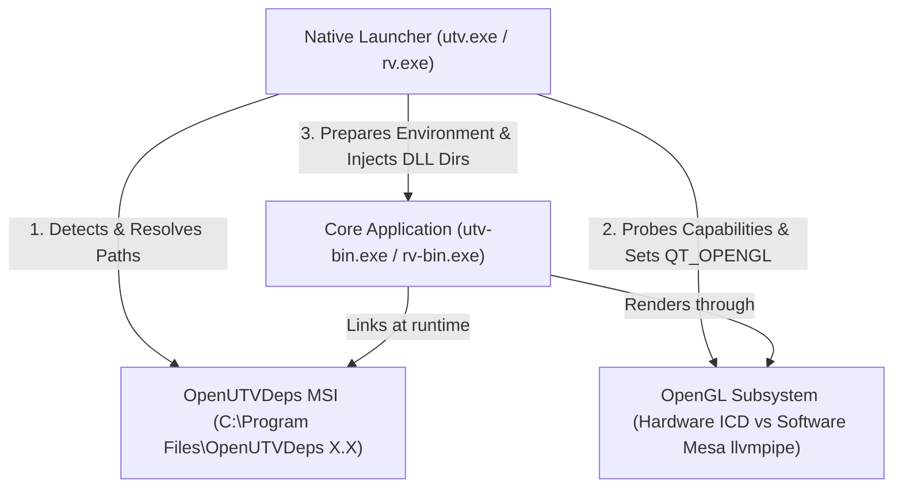
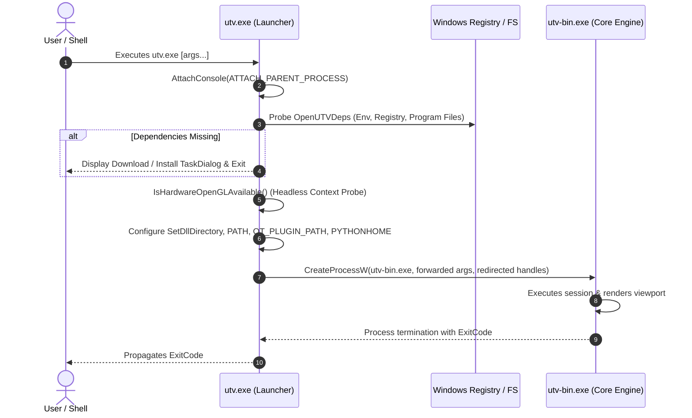
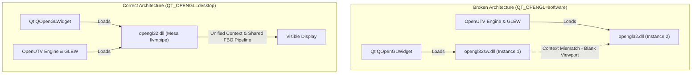
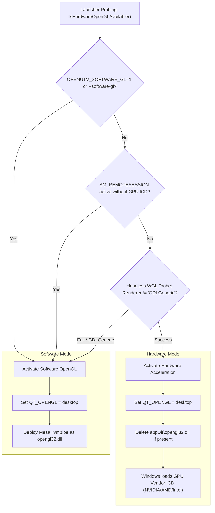

# Windows Runtime & Subsystem Architecture

This document provides an in-depth reference for the runtime architecture, bootstrapping mechanisms, dependency discovery strategy, and OpenGL graphics subsystem for OpenUTV on Microsoft Windows.

---

## 1. Architectural Overview

OpenUTV on Windows operates under a decoupled runtime model to optimize release binary sizes, support headless/remote rendering environments (e.g. Remote Desktop, Proxmox, and VMware VMs), and guarantee binary compatibility across diverse user configurations.

The system is architected into three primary components:



1. **Native Trampoline Launcher (`utv.exe` / `rv.exe`)**: A lightweight C++ wrapper that detects dependencies, configures DLL directories and environment variables, probes OpenGL hardware capabilities, and launches the core application.
2. **External Dependencies (`OpenUTVDeps`)**: Heavyweight third-party libraries (Qt 6, PySide6, Boost, Python, OpenEXR, OpenColorIO, FFmpeg, etc.) installed centrally or side-by-side.
3. **Core Application (`utv-bin.exe` / `rv-bin.exe`)**: The compiled UTV/RV application binary linked dynamically against OpenUTVDeps.

---

## 2. The Trampoline Launcher (`utv.exe` vs `utv-bin.exe`)

### Rationale

On Windows, dynamic link libraries (DLLs) specified in the Import Address Table (IAT) are resolved by the Windows OS loader at process initialization time **before** any application code (such as `main()`) executes. If essential DLLs (like `Qt6Core.dll` or `boost_python.dll`) are not in the application directory or system `PATH`, the process terminates immediately with an obscure OS loader error (e.g. `0xc0000135`).

Furthermore, GUI applications compiled with the Windows subsystem (`/SUBSYSTEM:WINDOWS`) do not inherit parent console handles by default, breaking CLI workflow pipes.

The trampoline launcher resolves these challenges:



### Key Responsibilities of `UTVLauncherWin.cpp`

1. **Console Attachment**:
   Calls `AttachConsole(ATTACH_PARENT_PROCESS)` at entry. If launched from PowerShell or `cmd.exe`, stdout/stderr seamlessly stream to the terminal without popping open an unwanted extra console window.
2. **Argument & I/O Forwarding**:
   Parses the raw command line via `GetCommandLineW()`, strips the launcher executable name, passes all parameters verbatim to `utv-bin.exe`, and forwards `STD_INPUT_HANDLE`, `STD_OUTPUT_HANDLE`, and `STD_ERROR_HANDLE`.
3. **Process Lifecycle Management**:
   Waits for `utv-bin.exe` to complete via `WaitForSingleObject()` and returns its exact exit code.

---

## 3. Dependency Discovery Strategy (`OpenUTVDeps`)

To prevent multi-gigabyte release archives, OpenUTV release packages ship only the application binaries and plugins. Heavy third-party dependencies are installed independently via the **OpenUTVDeps MSI** installer.

The launcher executes the following discovery cascade in strict order:

| Priority | Method | Description |
| :--- | :--- | :--- |
| **1** | `OPENUTV_DEPS_ROOT` Env Var | Explicit process override set by CI scripts or developers. |
| **2** | Machine Registry Env | `HKLM\SYSTEM\CurrentControlSet\Control\Session Manager\Environment`. Captures new MSI installations without requiring a system reboot or shell restart. |
| **3** | User Registry Env | `HKCU\Environment`. Captures per-user dependency setups. |
| **4** | Windows Uninstall Registry | Enumerates `SOFTWARE\Microsoft\Windows\CurrentVersion\Uninstall` (and WOW6432Node) across `HKLM` and `HKCU` looking for installed `OpenUTVDeps` packages. |
| **5** | Filesystem Scan | Scans `C:\Program Files\OpenUTVDeps*` and picks the latest directory version (e.g. `OpenUTVDeps 26.5` over `26.4`). |
| **6** | Relative Paths | Checks relative directories for portable installs (`..\deps`, `..\..\utv-dependencies`). |
| **7** | System `PATH` Probe | Searches for indicator DLLs (`OpenImageIO.dll`, `glew32.dll`, `Qt6Core.dll`). |

### Missing Dependencies UX

If no valid dependency tree is located, the launcher displays an interactive Windows TaskDialog (with fallback to `MessageBoxW`) providing direct links to download the matching OpenUTVDeps MSI release from GitHub.

---

## 4. Environment & DLL Directory Injection

Once the dependency root is determined, the launcher configures the process environment before spawning `utv-bin.exe`:

### DLL Search Directories
- Invokes `SetDllDirectoryW(depsBin)` and `AddDllDirectory()` with `LOAD_LIBRARY_SEARCH_DEFAULT_DIRS | LOAD_LIBRARY_SEARCH_USER_DIRS`.
- Injects:
  - `depsRoot\bin` (or `depsRoot\installed\x64-windows\bin`)
  - `depsPySide` (e.g. `python\Lib\site-packages\PySide6`)
  - `depsPySide\..\shiboken6`
  - `depsPython` (e.g. `python`)
  - `appDir`

### PATH Prepending
Prepends `appDir`, `depsBin`, `depsPySide`, `depsPython`, and `depsPython\Scripts` to the active `PATH` environment variable.

### Python Environment
- **`PYTHONHOME`**: Set to `depsPython` (e.g. `C:\Program Files\OpenUTVDeps 26.5\python`) if not already defined.
- **PyOpenColorIO**: The Python module `PyOpenColorIO` must be placed in `PlugIns/Python/PyOpenColorIO` (containing `__init__.py` and `_PyOpenColorIO.pyd`). Without this, OCIO initialization fails with:
  ```text
  ModuleNotFoundError: No module named 'PyOpenColorIO'
  ERROR: python module ocio_source_setup could not be imported
  ```

### Qt 6 Plugin & Resource Variables
If using PySide6's Qt distribution, the launcher ensures the following paths are populated:
- `QT_PLUGIN_PATH`: Points to `depsPySide\plugins`, `depsRoot\plugins`, and `appDir\plugins\Qt`.
- `QTWEBENGINEPROCESS_PATH`: Points to `depsPySide\QtWebEngineProcess.exe`.
- `QTWEBENGINE_RESOURCES_PATH`: Points to `depsPySide\resources`.
- `QTWEBENGINE_LOCALES_PATH`: Points to `depsPySide\translations\qtwebengine_locales`.
- `QML2_IMPORT_PATH` / `QML_IMPORT_PATH`: Points to `depsPySide\qml`.

---

## 5. OpenGL Subsystem Architecture

OpenUTV relies heavily on modern OpenGL for timeline playback, color transforms (via OCIO GLSL shaders), image filtering, and viewport overlays. Managing OpenGL on Windows presents unique challenges due to headless virtualization and Qt 6 architecture.

### The Dual-Driver Collision Trap

> [!CAUTION]
> **CRITICAL ARCHITECTURAL RULE**: **NEVER** set `QT_OPENGL=software` if Mesa llvmpipe is bundled or copied as `opengl32.dll` in the application directory.

#### The Failure Mechanism

During development of software OpenGL fallback, setting `QT_OPENGL=software` resulted in a severe rendering defect:
- The Qt UI loaded correctly.
- However, dragging an image (e.g. `Desk.exr`) into the viewport showed **no drag/drop overlay** ("Add Source to Session") and **a completely black/blank viewport**, despite the session successfully loading media into memory.

#### Root Cause Analysis

On Windows with Qt 6:
1. When `QT_OPENGL=software` is set, Qt's Windows QPA plugin (`qwindows.dll`) explicitly calls `LoadLibraryW(L"opengl32sw.dll")` to create its OpenGL contexts.
2. In contrast, `utv-bin.exe` and `glew32.dll` are linked against the standard Windows `opengl32.dll`.
3. If Mesa llvmpipe was copied to `opengl32.dll` to satisfy UTV and GLEW, **two completely separate instances of Mesa llvmpipe ran concurrently within the same process**:
   - `Qt6OpenGLWidgets.dll` created context `A` inside `opengl32sw.dll`.
   - OpenUTV (`Session::render()` and `drawDropSites()`) issued draw calls to context `B` inside `opengl32.dll`.
4. Because context `B` had no connection to context `A` or the underlying `QOpenGLWidget` swapchain, all of UTV's draw calls were rendered into an unassociated buffer, leaving the visible widget completely blank.



#### The Unified Solution

Setting `QT_OPENGL=desktop` forces Qt's Windows QPA to call `LoadLibraryW(L"opengl32.dll")`. When software rendering is required:
1. Mesa llvmpipe is placed in the application directory as `opengl32.dll`.
2. `QT_OPENGL` is set to `desktop`.
3. Both Qt and OpenUTV resolve their OpenGL symbols from the same DLL instance (`appDir\opengl32.dll`), ensuring shared contexts, texture IDs, and framebuffer objects operate seamlessly.

---

## 6. Hardware vs Software OpenGL Switching

To provide optimal performance on GPU workstations while preserving out-of-the-box reliability in virtual machines and Remote Desktop (RDP) sessions, the launcher performs dynamic OpenGL driver management:



### Probing Mechanism Details (`IsHardwareOpenGLAvailable()`)

1. **User Overrides**:
   Inspects `OPENUTV_SOFTWARE_GL` and command-line flags `--software-gl` / `-software-gl`.
2. **Remote Desktop & Registry ICD Check**:
   Queries `GetSystemMetrics(SM_REMOTESESSION)`. If running inside an RDP session, it checks `HKLM\SOFTWARE\Microsoft\Windows NT\CurrentVersion\OpenGLDrivers` to ensure an enterprise virtual GPU driver (e.g. NVIDIA GRID, vGPU) is registered. If no hardware ICD exists, standard RDP defaults to Microsoft GDI Generic OpenGL 1.1, which lacks shaders and FBOs.
3. **Headless WGL Context Probe**:
   Creates a temporary 1x1 hidden window (`CreateWindowW(L"STATIC", ...)`), configures a pixel format, creates a WGL context, and queries `glGetString(GL_RENDERER)`. If the renderer contains `"GDI Generic"`, hardware acceleration is flagged as unavailable.

### Dynamic Switching Execution
- **Hardware Mode**: Deletes any bundled `opengl32.dll` in the application directory. Windows then falls through to `System32\opengl32.dll`, which loads the native GPU ICD driver.
- **Software Mode**: Deploys `opengl32sw.dll` as `appDir\opengl32.dll` and exports `QT_OPENGL=desktop`.

---

## 7. Summary of Invariant Rules for Developers

1. **Do not link `utv.exe` directly against Qt or OpenUTV core libraries.**
   Keep the launcher standalone with zero external DLL dependencies.
2. **Always set `QT_OPENGL=desktop` when providing a bundled `opengl32.dll`.**
   Never use `QT_OPENGL=software` unless you are intentionally testing Qt without OpenUTV's OpenGL pipeline.
3. **Keep `PyOpenColorIO` inside `PlugIns/Python/PyOpenColorIO`.**
   The folder must contain `__init__.py` and `_PyOpenColorIO.pyd`.
4. **Preserve `AttachConsole(ATTACH_PARENT_PROCESS)`.**
   CLI tools like `rvls` and CLI flags like `--help` rely on this for console output.
