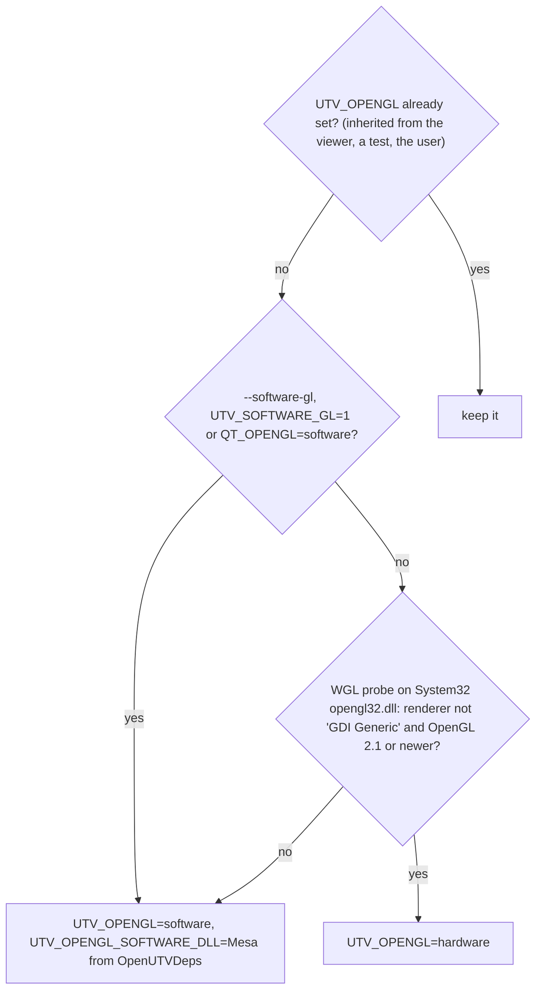

# Windows Runtime Architecture

How OpenUTV starts on Windows: the launchers, how they find the OpenUTVDeps runtime, the process environment, and how OpenGL uses the GPU driver or Mesa.

Goals:

- A release zip works when extracted anywhere. The installer (`scripts/install.ps1`) is a convenience: it installs OpenUTVDeps, adds `cmd` to `PATH`, creates shortcuts and registers OpenUTV in *Installed Apps*.
- Nothing is written to the user or system environment except `<install>\cmd` on `PATH`. No `PYTHONHOME`, `QT_PLUGIN_PATH` or dependency directories in the global environment.
- Command line tools behave like console programs: a shell waits for them and gets their output and exit code, and a caller that starts them without a window (the viewer, scripts) gets no console window.
- The GPU is used whenever there is a working OpenGL driver; machines without one (VMs, RDP) fall back to Mesa llvmpipe.

---

## 1. Installed Layout

```text
<install>\
  bin\
    utv.exe              GUI launcher        -> utv-bin.exe (the viewer)
    rv.exe               GUI launcher        -> utv-bin.exe
    utvio.exe            console launcher    -> utvio-bin.exe
    rvio.exe             console launcher    -> utvio-bin.exe
    py-interp.exe        console launcher    -> py-interp-bin.exe
    ...                  every program in bin: <name>.exe -> <name>-bin.exe
    utv-bin.exe, utvio-bin.exe, py-interp-bin.exe, ...
    opengl32.dll         OpenGL forwarder (section 5)
    openutv-deps-version.txt
    *.dll                OpenUTV libraries, Python DLLs, MSVC runtime
  cmd\                   copies of every launcher and the helper .cmd scripts; the only directory on PATH
  lib\  PlugIns\  resources\  scripts\  etc\
```

The build stages the real programs under their own names (`utvio.exe`) plus two launchers, `utv.exe` and `utv-cli-launcher.exe`. `cmake --install` (`cmake/install/post_install_windows.cmake`) creates the layout above: it renames each program to `<name>-bin.exe`, puts a copy of the console launcher in its place, adds the legacy `rv*` names as launchers, and fills `cmd`.

`cmd` is on `PATH` instead of `bin` (as Git for Windows does with its own `cmd`): `bin` holds `python3.dll`, `python314.dll`, the MSVC runtime and `opengl32.dll`, which other programs would otherwise find through their DLL search. The launchers in `cmd` run the programs in `..\bin`.

The legacy `rv*` names (`rv`, `rvio`, `rvls`, `rvpkg`, `rvprof`, `rvpush`, `rvshell`) are launcher copies, not symbolic links: links need administrator rights or Developer Mode on Windows and do not survive a zip.

---

## 2. The Launchers (`src/bin/apps/rv/UTVLauncherWin.cpp`)

One source, two executables:

| Executable | Subsystem | Installed as | Reports errors |
| --- | --- | --- | --- |
| `utv.exe` | Windows (GUI) | `utv.exe`, `rv.exe` | dialog, and stderr when started from a terminal |
| `utv-cli-launcher.exe` (`UTV_CONSOLE_LAUNCHER`) | Console | every other program | stderr |

The subsystem matters. Windows only starts a console for a console program, and only a shell waits for a console program. A GUI launcher in front of a console tool means: the shell returns at once and the exit code is lost, and when the caller has no console (the viewer starting `py-interp` or `utvio` with `CREATE_NO_WINDOW`) the console tool gets a new, visible console window. That was the console flashing in issue #58.

Each launcher:

1. **Finds its programs**: its own directory, or `..\bin` for the copies in `cmd`. Symbolic links (winget's portable aliases) are resolved first.
2. **Finds OpenUTVDeps** (section 3) and reports a missing or wrong release with the release to install and its download page.
3. **Sets the environment of its own process** (section 4). The program it starts inherits it, and so does everything that program starts.
4. **For OpenGL programs** (`utv`, `rv`, `utvio`, `rvio`, `utvprof`, `rvprof`): decides between the GPU driver and Mesa (section 5).
5. **Starts `<name>-bin.exe`** with the caller's arguments exactly as typed (`--software-gl` is the launcher's own option and is removed), the caller's standard handles, and:
   - the error mode `SEM_FAILCRITICALERRORS`, inherited by the program, so a missing or mismatched DLL ends it with an NTSTATUS exit code (`0xC0000135`, `0xC0000139`, ...) instead of one system dialog per DLL. The launcher turns that into one message naming the OpenUTVDeps release it used and the one the build needs;
   - a job object with `JOB_OBJECT_LIMIT_KILL_ON_JOB_CLOSE`, so killing the launcher (a script's timeout, Task Manager) ends the program too. `JOB_OBJECT_LIMIT_SILENT_BREAKAWAY_OK` keeps processes the program starts (a browser, an editor) out of the job.
6. **Waits** and returns the program's exit code. The console launcher ignores Ctrl+C itself; the program gets it and exits.

`utv --run <command> [args...]` runs any program with the OpenUTV environment.

The launcher never writes to the installation directory.

### Programs the viewer starts

The viewer already runs with the launcher's environment, so it starts the programs directly: `QTBundle::executableFile()` returns `<name>-bin.exe` when it exists, which is what `RV_APP_RVIO`, `RV_APP_RVPKG`, ... point to, and the help menu runs `py-interp-bin.exe`. That saves a process, and the session manager's thumbnail jobs can be suspended during playback and killed on timeout (a suspended or killed launcher would not affect the program behind it).

---

## 3. Finding OpenUTVDeps

A build only works with the OpenUTVDeps release it was compiled against: the library names (`OpenColorIO_2_5.dll`, ...) and ABIs change between releases. That release is pinned in `cmake/openutv-deps-version.txt`. CMake builds against it, CI installs exactly it, the launchers compile it in (`UTV_DEPS_VERSION`), and the package ships it as `bin\openutv-deps-version.txt` for the installer.

A directory counts as OpenUTVDeps when it has `bin\OpenImageIO.dll`, `tools\python3\python.exe` and `tools\python3\Lib\site-packages\PySide6\Qt6Core.dll` (or the same under `installed\x64-windows` for a vcpkg tree).

Candidates, in order:

| Source | Version from |
| --- | --- |
| `UTV_DEPS_ROOT` | directory name; used first unless that names another release (earlier installers stored it for users) |
| *Installed Apps* (`Uninstall` registry keys, HKLM and HKCU) whose name starts with `OpenUTVDeps` | `DisplayVersion` |
| `OPENUTV_DEPS_ROOT` (the OpenUTVDeps MSI sets it system-wide) | directory name |
| `%ProgramFiles%\OpenUTVDeps*`, `%LOCALAPPDATA%\Programs\OpenUTVDeps*`, `%LOCALAPPDATA%\OpenUTVDeps*` | directory name (`OpenUTVDeps 26.5`) |
| `..\deps`, `..\..\deps`, `..\..\utv-dependencies[\exported_deps\utv-deps-windows-x64]` next to the programs (development trees) | unknown |

The first complete candidate of exactly the pinned release is used; otherwise the first complete one of unknown version. A complete installation of another release is never used: the user is told which release the build needs instead of getting loader errors or a crash.

Nothing is searched on `PATH`: a Qt or Python that happens to be there is not OpenUTVDeps.

---

## 4. Process Environment

Set by the launcher for its process and inherited by the program:

| Variable | Value |
| --- | --- |
| `PATH` | `bin`, OpenUTVDeps `bin`, PySide6, shiboken6, Python, Python `Scripts`, then the caller's `PATH` |
| `PYTHONHOME` | OpenUTVDeps Python, always (another Python's `PYTHONHOME` would break the embedded interpreter). `PYTHONPATH` is left alone. |
| `QT_PLUGIN_PATH`, `QT_QPA_PLATFORM_PLUGIN_PATH` | PySide6 `plugins`, `plugins\platforms`, always |
| `QTWEBENGINEPROCESS_PATH`, `QTWEBENGINE_RESOURCES_PATH`, `QTWEBENGINE_LOCALES_PATH`, `QML2_IMPORT_PATH`, `QML_IMPORT_PATH` | PySide6 paths |
| `QT_OPENGL` | `desktop` (and `QT_OPENGL_DLL` removed): Qt must use the same `opengl32.dll` as OpenUTV |
| `UTV_DEPS_ROOT`, `OPENUTV_DEPS_ROOT` (and `*_SLASH`) | the OpenUTVDeps root |
| `UTV_HOME`, `OPENUTV_HOME` | `bin` |
| `UTV_OPENGL`, `UTV_OPENGL_SOFTWARE_DLL` | OpenGL programs only, section 5 |

`PyOpenColorIO` must be in `PlugIns\Python\PyOpenColorIO` (`__init__.py` and `_PyOpenColorIO.pyd`), or OCIO initialization fails with `No module named 'PyOpenColorIO'`.

---

## 5. OpenGL: GPU Driver or Mesa

OpenUTV's executables, `glu32.dll`, Qt (which loads `opengl32.dll` by name) and GDI (`SetPixelFormat` and `SwapBuffers` call into it) must all use one OpenGL implementation per process. Two implementations in one process means Qt's context and OpenUTV's are unrelated: Qt draws its widgets and the viewport stays black. So `QT_OPENGL=software`, which makes Qt load `opengl32sw.dll` next to OpenUTV's `opengl32.dll`, must never be used.

### The forwarder (`src/bin/apps/rv/opengl32/`)

`bin\opengl32.dll` exports exactly what the Windows `opengl32.dll` exports (368 functions, generated by `generate_opengl32.py`). Windows loads it from the application directory before `System32`, for every module in the process. On the first OpenGL call it loads the real implementation and forwards every call there:

| `UTV_OPENGL` | Implementation |
| --- | --- |
| `hardware`, or unset | `System32\opengl32.dll`, which loads the GPU vendor's driver (NVIDIA, AMD, Intel, VMware/Parallels guest drivers) |
| `software` (or unset and `UTV_SOFTWARE_GL=1`) | Mesa llvmpipe: `UTV_OPENGL_SOFTWARE_DLL`, else `opengl32sw.dll` next to the forwarder, else PySide6's `opengl32sw.dll` in OpenUTVDeps |

The choice is per process, so the installation directory is never modified and processes with different choices can run side by side. Mesa is not shipped with OpenUTV: OpenUTVDeps has it with PySide6. Extension functions come from the implementation's `wglGetProcAddress` and are called directly; only OpenGL 1.1 calls go through the forwarder.

### The decision (launcher)


```mermaid
flowchart TD
    Inherited{"UTV_OPENGL already set? (inherited from the viewer, a test, the user)"}
    Forced{"--software-gl, UTV_SOFTWARE_GL=1 or QT_OPENGL=software?"}
    Probe{"WGL probe on System32 opengl32.dll: renderer not 'GDI Generic' and OpenGL 2.1 or newer?"}
    Hardware["UTV_OPENGL=hardware"]
    Software["UTV_OPENGL=software, UTV_OPENGL_SOFTWARE_DLL=Mesa from OpenUTVDeps"]

    Inherited -- yes --> Keep["keep it"]
    Inherited -- no --> Forced
    Forced -- yes --> Software
    Forced -- no --> Probe
    Probe -- yes --> Hardware
    Probe -- no --> Software
```

"GDI Generic" is the OpenGL 1.1 renderer Windows falls back to without a GPU driver: Hyper-V and VirtualBox without 3D, the Microsoft Basic Display Adapter, RDP sessions without a GPU. The probe takes about 100 to 150 ms and only runs in the launchers of OpenGL programs; programs the viewer starts inherit its decision.

### Laptops with two GPUs

`utv-bin.exe` and `utvio-bin.exe` export `NvOptimusEnablement` and `AmdPowerXpressRequestHighPerformance`, so NVIDIA Optimus and AMD switchable graphics run their OpenGL on the discrete GPU.

---

## 6. Rules for Developers

1. Keep the launchers free of Qt and OpenUTV libraries: they must run before OpenUTVDeps is found.
2. Command line programs need the console launcher, GUI programs the GUI launcher. A new program in `bin` gets the console launcher automatically; a new legacy alias goes into `kTools` in `UTVLauncherWin.cpp` and `_rv_aliases` in `post_install_windows.cmake`.
3. Never set `QT_OPENGL=software`, and never put Mesa in `bin` as `opengl32.dll`: select software rendering with `UTV_OPENGL=software`.
4. Load the system OpenGL in tools by full path or with `LOAD_LIBRARY_SEARCH_SYSTEM32`: `opengl32.dll` in `bin` is the forwarder.
5. Bump `cmake/openutv-deps-version.txt` together with a new OpenUTVDeps release; nothing else names the version.
6. Test the installed layout with `src/test/CliSmokeTest/launcher_test.py --install-dir <install>`; CI runs it on `_install`.
